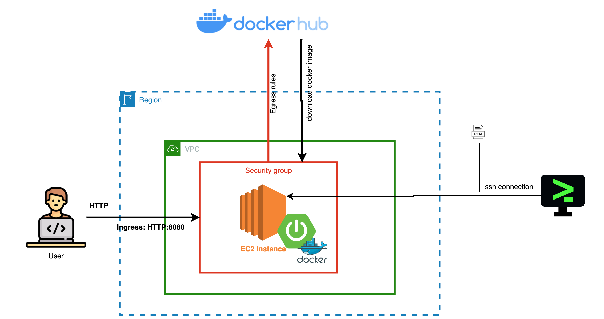

# Spring Boot AWS Deployment Demo

A small Spring Boot application packaged with Docker and structured as a deployment demo for AWS EC2.

## What This Project Demonstrates

- Building a Spring Boot application with Java 17 and Maven
- Packaging the application as a Docker image
- Exposing a simple HTTP endpoint
- Deploying a containerized application to an AWS EC2 instance
- Documenting the deployment architecture

## Architecture



The included Draw.io source is available in [`aws-deploy-infra.drawio`](aws-deploy-infra.drawio).

## Tech Stack

- Java 17
- Spring Boot
- Maven
- Docker
- AWS EC2

## Run Locally

### Prerequisites

- Java 17 or newer
- Maven 3.8 or newer

Clone the repository:

```bash
git clone https://github.com/knoxdevchris/aws-cloud-demo.git
cd aws-cloud-demo
```

Run the application:

```bash
mvn spring-boot:run
```

Open `http://localhost:8080` in a browser.

## Demo Endpoint

The application exposes:

```text
GET /api/v1/demo
```

Example:

```bash
curl http://localhost:8080/api/v1/demo
```

Each request increments a small in-memory response counter so it is easy to verify that the running application is responding.

## Run with Docker

Build the image:

```bash
docker build -t aws-cloud-demo .
```

Run the container:

```bash
docker run --rm -p 8080:8080 aws-cloud-demo
```

Then visit `http://localhost:8080` or call the demo endpoint.

## AWS Deployment Overview

A basic EC2 deployment workflow for this project is:

1. Launch an EC2 instance and allow the application port through the appropriate security-group rule.
2. Install Docker on the instance.
3. Build or pull the application image.
4. Run the container with the required port mapping.
5. Verify the application through the instance's public address or a configured DNS name.

For a production deployment, additional controls such as HTTPS, restricted security-group rules, monitoring, secrets management, and a managed deployment service should be considered.

## Project Layout

```text
.
├── Dockerfile
├── README.md
├── aws-deploy-infra.drawio
├── springboot-aws-deploy.png
├── pom.xml
└── src/
```

## Notes

Build output such as Maven's `target/` directory is intentionally excluded from source control.
